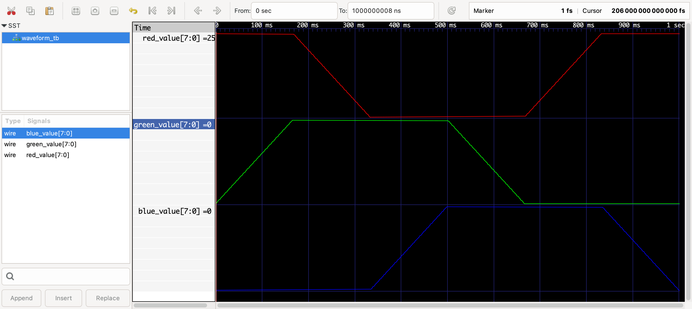

# Miniproject 2

SystemVerilog PWM controller for a one-second HSV color cycle on the iceBlinkPico
RGB LED.

[Video 1](https://youtube.com/shorts/SzpYpINsRao?feature=share) ·
[Video 2](https://youtube.com/shorts/eBuayHG3Cig?feature=share) ·
[Video 3](https://youtube.com/shorts/BYrxljBwPDE?feature=share) ·
[Video 4](https://youtube.com/shorts/ymdFnU9f08g?feature=share)
